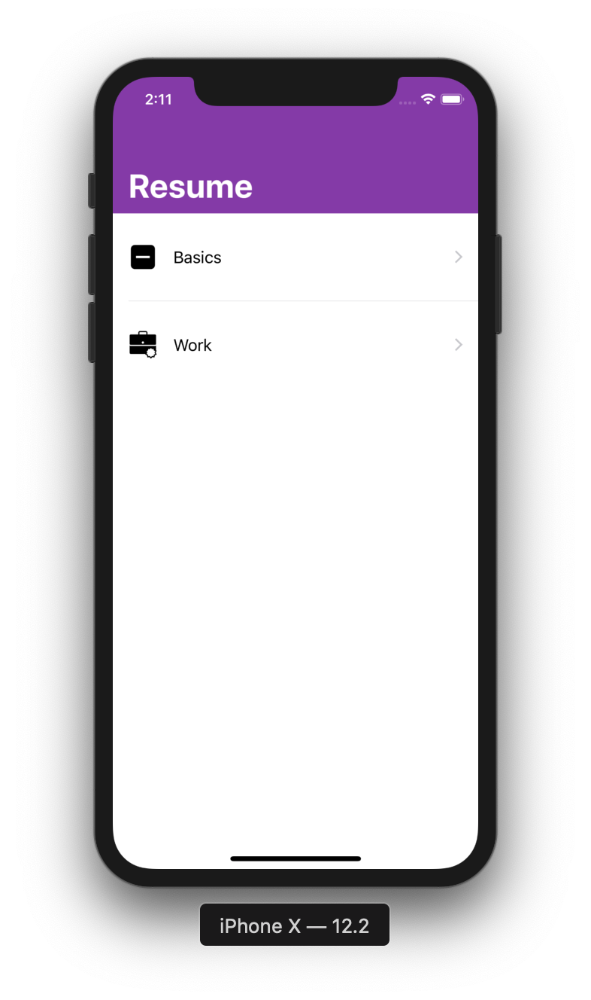
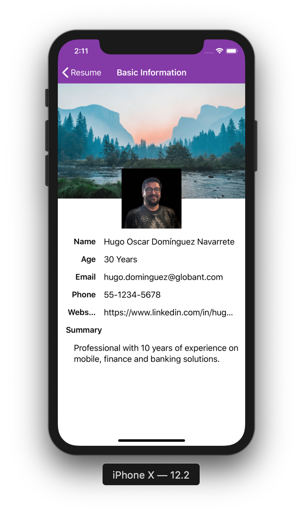
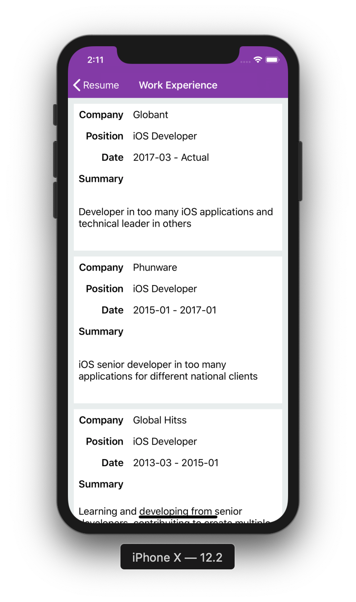
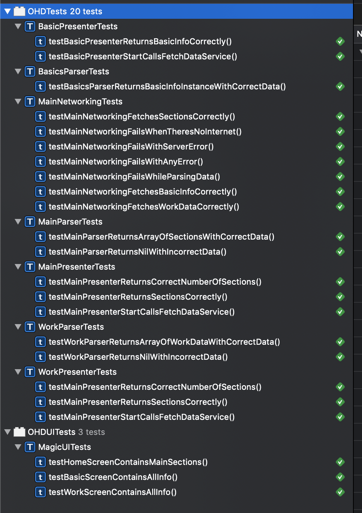

# Application Resume
This application was created to show the user information in model view presenter architecture pattern, the information has a simple representation in two view controllers, a section controller and its detail part.

## Specs
- Architecture: Model View Present
- Swift version: 4.2
- Xcode version: 10.1

## Screenshots

